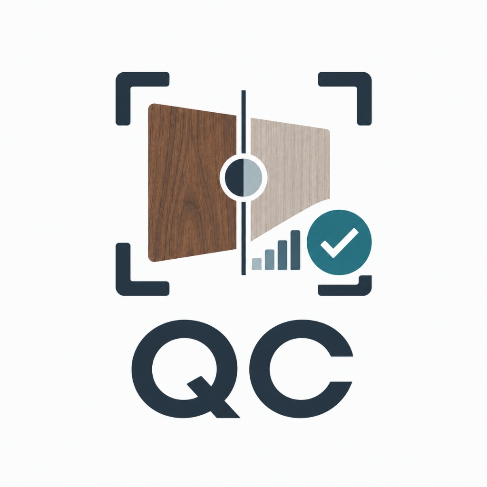

# Studio Color Consistency & Material QC System

<div align="center">
  
  <p><strong>Aplikasi Desktop Windows untuk Konsistensi Warna & Kontrol Kualitas Material Furnitur Studio</strong></p>
  <p><em>Repositori Resmi: <a href="https://github.com/Luciansvon/AI-COLOR-COMPARE">Luciansvon/AI-COLOR-COMPARE</a></em></p>
</div>

---

## Ekspor batch dari satu foto acuan (perubahan lokal setelah v0.3.6)

1. Masukkan master dan satu foto produk, lalu tekan **Bandingkan Sekarang**.
2. Terapkan saran atau atur slider, kemudian periksa **Preview Koreksi**.
3. Pada **Pakai Koreksi Ini ke Foto Lain**, pilih foto tambahan dari produk dan pencahayaan yang sama.
4. Tekan **Ekspor Acuan + ... Foto ke ZIP**. Foto acuan ikut diekspor bersama foto tambahan.

Semua foto memakai salinan nilai slider saat ekspor dimulai. Tidak ada perhitungan saran otomatis baru per foto. ZIP berisi JPEG dan `koreksi-batch.json` yang mencatat foto acuan, parameter koreksi, serta pemetaan nama berkas. Nama duplikat diberi nomor. Gagal memproses satu foto atau pembatalan menghentikan batch tanpa mengunduh ZIP parsial.

Batas per batch: 50 foto termasuk acuan, total input dan hasil JPEG masing-masing maksimal 200 MB; format JPG, PNG, dan WebP. Proses berjalan berurutan di perangkat, tanpa mengunggah foto. Setelan yang sama tidak menjamin warna akhir identik bila cahaya atau eksposur foto berbeda. Batch tidak membuat keputusan PASS/FAIL otomatis.

Status audit dan batas pengujian: [AUDIT_BATCH_2026-09-08.md](AUDIT_BATCH_2026-09-08.md).

## 🎨 Analisis RGB untuk Operator Studio

**Pembaruan v0.3.5:** panel RGB operator, slider hijau–magenta, dan angka kecerahan yang lebih jelas. Master 20 → produk 30 ditampilkan **+10 poin pada skala 0–100**. Kartu dan laporan memakai perhitungan yang sama. Baca [catatan v0.3.5](RELEASE_v0.3.5.md) dan [hasil audit](AUDIT_OPERATOR_v0.3.5.md).

Mulai v0.3.3, hasil QC menerjemahkan pergeseran RGB menjadi bahasa sederhana untuk operator:

- **Warna Seimbang**
- **Sedikit / Cenderung Kemerahan**
- **Sedikit / Cenderung Kehijauan**
- **Sedikit / Cenderung Kebiruan**

Sistem tidak membandingkan angka R, G, dan B mentah karena kayu coklat memang secara alami memiliki kanal merah lebih tinggi. Yang dibandingkan adalah **proporsi RGB produk terhadap master fisik pada ROI yang sama**, lalu arah warnanya divalidasi lagi dengan sumbu Lab.

Untuk kamera studio **Canon EOS 80D**, aplikasi memberi arah koreksi White Balance Correction yang mudah dibaca, misalnya **B (Blue)**, **A (Amber)**, **G (Green)**, atau **M (Magenta)**. Sistem hanya menyarankan mulai dari 1 langkah lalu foto ulang dan bandingkan lagi; jumlah langkah tidak ditebak dari angka Lab.

Dokumentasi lengkap: [RGB_ANALYSIS.md](RGB_ANALYSIS.md)

---

## 🛡️ Guardrail QC v0.3.4

v0.3.4 memperketat cara aplikasi menjelaskan hasil agar operator tidak mendapat kesimpulan yang lebih pasti daripada bukti pengukurannya.

- Pergeseran chromatic besar **tidak lagi otomatis divonis sebagai Material / Finishing**. Jika bukti capture belum cukup, hasil menjadi **Belum Pasti** dan operator diminta menstabilkan lampu, exposure, sudut/refleksi, White Balance, serta profil kamera sebelum foto ulang terhadap master.
- Highlight clipping sekarang dideteksi **per kanal RGB**. Satu kanal yang mentok sudah cukup untuk menandai data warna sebagai tidak aman untuk dinilai.
- Angka ΔE00 yang dipakai UI disebut **ambang internal aplikasi**, bukan toleransi universal untuk semua material atau proyek.
- UI tidak lagi menyatakan foto "aman lolos QC" ketika diagnosis masih belum pasti.
- Jika texture/serat belum benar-benar diukur, UI menampilkan **Belum Diukur**, bukan nilai palsu seperti 100% identik.
- PASS/FAIL tetap keputusan operator berdasarkan physical master dan seluruh evidence yang tersedia.

Catatan lengkap siklus audit: [LOOP_QC_2026-09-07.md](LOOP_QC_2026-09-07.md)

Catatan release: [RELEASE_v0.3.4.md](RELEASE_v0.3.4.md)

---

## 🔄 Instalasi & Pembaruan Windows

Rilis Windows memakai installer **NSIS current-user** dengan identitas aplikasi tetap:

- Product name: `Studio Color QC`
- Identifier: `com.studio.colorqc`
- Install mode: `currentUser`

Saat installer versi baru dijalankan di PC yang sudah memiliki Studio Color QC, instalasi lama **di-upgrade / ditimpa di lokasi aplikasi yang sama**, bukan membuat aplikasi kedua. Downgrade ke versi lebih lama juga diblokir.

> Catatan: rilis lama berbentuk executable portable tidak dihitung sebagai instalasi Windows. Upgrade-in-place berlaku untuk jalur installer NSIS mulai v0.3.2 dan seterusnya.

---

## 💡 Cara Menjalankan Aplikasi

### Mode 1: Pratinjau Web Cepat (Browser)
Sangat praktis untuk mencoba tampilan dan simulasi langsung di peramban:
```bash
npm run dev
```
Buka di browser: `http://localhost:3000`

### Mode 2: Aplikasi Desktop Asli Windows (Tauri 2)
Menjalankan aplikasi dalam jendela native Windows terintegrasi dengan backend Rust dan database SQLite:
```bash
npm run desktop:dev
```

---

## 🧪 Pengujian Kualitas & Sains Warna Otomatis

Untuk memverifikasi keakuratan rumus warna CIEDE2000, pendeteksi konflik koreksi, database SQLite, pengamanan berkas, diagnosis RGB, guardrail clipping, dan copy UI:
```bash
# Uji Sains Warna & Integritas File + regression guardrail
npm test

# Uji khusus analisis RGB
npx tsx tests/rgb_analysis.test.ts

# Uji Native Core Rust & Database SQLite
cargo test --manifest-path src-tauri/Cargo.toml
```

Sebelum release Windows, workflow juga membangun installer NSIS dan memeriksa bahwa upgrade dari versi sebelumnya menghasilkan **tepat satu instalasi Studio Color QC**.

---

## 🛡️ Prinsip Keamanan & Desain Produk

1. **Physical Master adalah Acuan Utama**: Sistem membandingkan foto produk terhadap sampel master fisik kayu yang dipilih secara manual oleh operator.
2. **Otoritas Mutlak Operator**: Keputusan Lolos (**PASS**) atau Gagal (**FAIL**) sepenuhnya berada di tangan operator studio.
3. **Keaslian File 100% Terjaga (Non-Destructive)**: Berkas asli kamera tidak pernah ditimpa atau diubah.
4. **Pendeteksi Konflik Koreksi**: Mencegah fitur otomatis jika penyesuaian warna pada satu bagian kayu justru merusak bagian kayu lainnya.
5. **RGB Bukan Penentu PASS/FAIL Tunggal**: RGB hanya menjelaskan arah pergeseran warna. Keputusan QC tetap memakai keseluruhan bukti seperti ΔE00, Lab, brightness, texture, dan pemeriksaan operator.
6. **Tidak Mengarang Evidence**: Jika texture atau penyebab belum terbukti, UI harus menyatakan belum diukur/belum pasti.
7. **Ringan & CPU-First**: Berjalan pada komputer standar kantor studio (target RAM 8 GB tanpa kartu grafis khusus).
